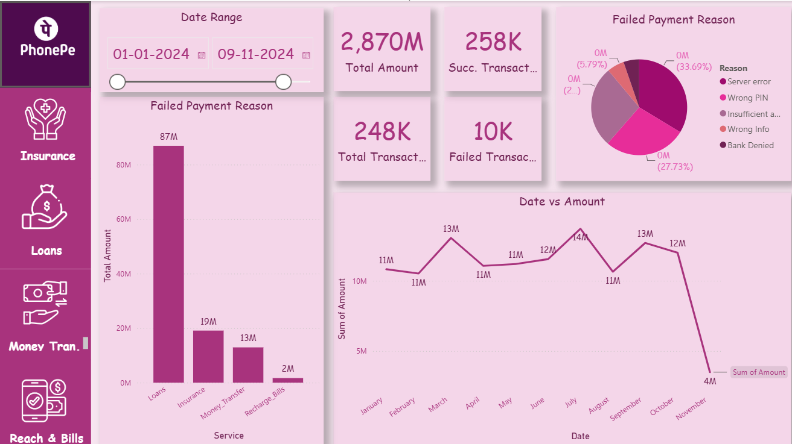
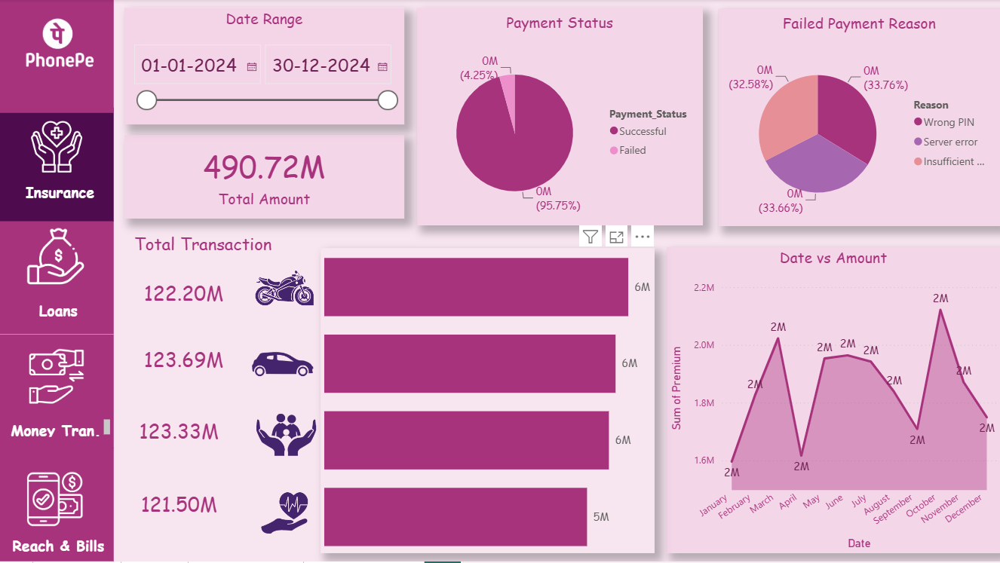
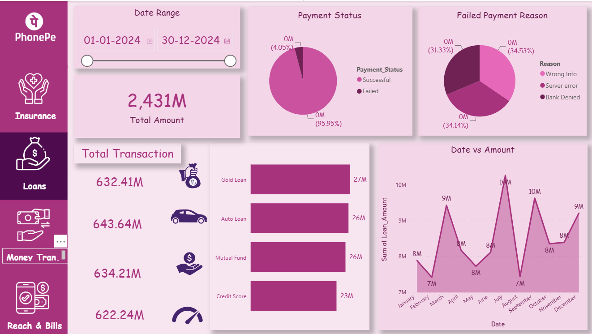

# 📊 PhonePe Transaction Analysis Dashboard

## 📌 Project Overview
This project is an interactive **Power BI Dashboard** built using a simulated PhonePe transaction dataset. The dashboard provides comprehensive insights into digital payment transactions across multiple PhonePe services, helping users analyze transaction trends, payment success rates, failed payments, and service-wise performance.

The dashboard is designed with an intuitive navigation panel, allowing users to switch seamlessly between different PhonePe services such as Insurance, Loans, Money Transfer, and Recharge & Bills.

---

## 🚀 Features

- 📅 Interactive Date Range Filter
- 💰 Total Transaction Amount
- 📈 Total Transactions
- ✅ Successful Transactions
- ❌ Failed Transactions
- 📊 Monthly Transaction Trend Analysis
- 🥧 Failed Payment Reason Analysis
- 📌 Service-wise Transaction Comparison
- 📱 Multi-page Interactive Dashboard
- 🎨 User-friendly Power BI Design

---

## 📂 Dashboard Pages

### 🏠 Home Dashboard
- Overall transaction summary
- Total Amount
- Total Transactions
- Successful & Failed Transactions
- Monthly Amount Trend
- Failed Payment Reason Analysis

### 🛡 Insurance Dashboard
- Insurance premium analysis
- Payment status distribution
- Failed payment reasons
- Monthly premium trend
- Insurance category comparison

### 💵 Loans Dashboard
- Loan transaction analysis
- Loan type comparison
- Monthly loan amount trend
- Failed payment analysis
- Payment success ratio

### 💸 Money Transfer Dashboard
- Money transfer amount analysis
- Successful vs Failed transactions
- Monthly transaction trend
- Failed payment reasons

### 📱 Recharge & Bills Dashboard
- Recharge type comparison
- Monthly recharge trend
- Failed payment analysis
- Overall recharge transaction summary

---

## 📊 Key KPIs

- Total Transaction Amount
- Total Transactions
- Successful Transactions
- Failed Transactions
- Success Rate
- Failure Rate
- Monthly Revenue Trend
- Service-wise Transaction Analysis

---

## 🛠 Tools & Technologies

- Power BI
- Power Query
- DAX
- Data Modeling
- Microsoft Excel (Dataset)
- Interactive Visualizations

---

## 📈 Visualizations Used

- KPI Cards
- Bar Charts
- Pie Charts
- Line Charts
- Slicers
- Date Range Filters
- Navigation Buttons

---

## 🎯 Business Insights

- Monitor transaction performance across different PhonePe services.
- Identify the most common reasons for failed payments.
- Compare transaction volumes across multiple services.
- Analyze monthly transaction trends.
- Measure payment success and failure rates.
- Support data-driven business decision making.

---

## 📷 Dashboard Preview

### 🏠 Home Dashboard


### 🛡 Insurance Dashboard


### 💵 Loans Dashboard


### 💸 Money Transfer Dashboard


### 📱 Recharge & Bills Dashboard


---

## 📁 Repository Structure

```
PhonePe-Transaction-Analysis/
│
├── Dashboard.pbix
├── Dataset/
├── Images/
│   ├── HomePage.png
│   ├── Insurance.png
│   ├── Loans.png
│   ├── Money Transfer.png
│   └── Recharge & bill.png
├── README.md
└── LICENSE
```

---

## ⭐ Future Improvements

- Add Region/State-wise analysis
- Include Merchant category insights
- Add Customer segmentation
- Real-time data integration
- Forecast future transactions using Power BI forecasting

---

## 👩‍💻 Author

**Pratiksha Patil**

- 💼 Aspiring Data Analyst
- 📊 Power BI | SQL | Python | Excel
- 🌐 LinkedIn: https://www.linkedin.com/in/pratiksha-patil-193b48257/
